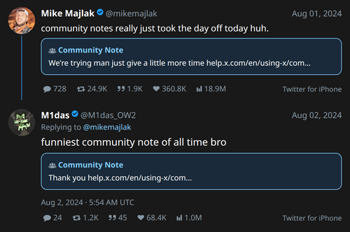

# tw2img
A tool that renders tweets as PNG images using Playwright (headless Chromium). Works with usernames, tweet IDs, URLs, local JSON files, or stdin.
This style is based on [nitter](https://github.com/zedeus/nitter/) using [Midnight](https://github.com/cmj/nitter/blob/master/public/css/themes/midnight.css) theme as default.
|  |  |
|---------------------------------|----------------------|
## Installation
```bash
# Install required packages
pip install playwright
playwright install chromium
```
## Quick Start
### 1. Guest Mode (no auth token required, missing context for replies)
```bash
# By @username (fetch latest tweet)
python tw2img.py @AP --guest
# By @username, fetch the 3rd most recent tweet
python tw2img.py @AP 3 --guest
# By tweet ID
python tw2img.py 2041557036274475228 --guest
# By tweet URL
python tw2img.py https://x.com/NASA/status/2041557036274475228 --guest
```
Here is a list of popular Twitter accounts sorted by most recent, and useful for guest access:\
  https://github.com/cmj/twitter-tools/wiki/RSS%E2%80%90Friendly

### 2. Authenticated Mode (full thread + reply data)
You need your Twitter auth tokens. Export them as environment variables:
```bash
export TWITTER_AUTH_TOKEN="your_auth_token_here"
export TWITTER_CSRF_TOKEN="your_ct0_token_here"
# alternative, only requires setting auth_token
export TWITTER_CSRF_TOKEN=$(openssl rand -hex 16)
```
Then run:
```bash
python tw2img.py 2054583770045386950
```
**Where to find tokens:** Open browser devtools, network tab, any x.com request, select cookies tab `auth_token` and `ct0`
## Basic Options
| Option | Description |
|--------|-------------|
| `@user` | Fetch latest tweet from this user |
| `--user <name>` | Same as above |
| `--light` | Use light theme (default is dark) |
| `--no-source` | Hide the "Twitter for iPhone" source text |
| `--no-context` | Show only the focal tweet, no thread/replies |
| `--no-retina` | Disable 2x retina rendering (smaller file) |
| `--full-stats` | Show full numbers instead of abbreviated (e.g. 12,345 instead of 12.3K) |
| `--output-dir <path>` | Directory to save output PNG (default: current working directory) |
| `--width 800` | Set output width in pixels (default: 598) |
| `--css theme.css` | File to override the theme (ex: nitter/public/css/themes/pleroma.css) |
| `--nitter` | Use Nitter default theme |
| `--html-only` | Print HTML to stdout instead of rendering PNG |
| `--save-html` | Save HTML to this file instead of rendering PNG |
| `--imgur` | Upload PNG to imgur after rendering |
| `--dump-json` | Print raw API JSON to stdout and exit |
| `-c <file>` | Load config from a custom path (see Config below) |
## Config File
Options can be set as persistent defaults in a config file (INI format). Config is loaded in this order - later sources override earlier ones:

1. `~/.config/tw2img/tw2img.conf` - user default
2. `<script_dir>/tw2img.conf` - next to the script, if present
3. `-c /path/to/custom.conf` - explicit override
4. Command options / flags  always have highest priority

A default config is included as `tw2img.conf`. To install it:
```bash
mkdir -p ~/.config/tw2img
cp tw2img.conf ~/.config/tw2img/tw2img.conf
```

Set a default download directory in the config so you don't have to specify it each run:
```ini
[tw2img]
output_dir = ~/Pictures/tweets
```
If `output_dir` is set, all PNGs are saved there unless you pass an explicit output path (absolute or with a directory component) on the command line.

Use `-c` to load an alternate config for a specific run without touching your defaults:
```bash
python tw2img.py 2054583770045386950 -c ~/work/tw2img-work.conf --light
```
## Input Types
```bash
# @username shorthand - latest tweet
python tw2img.py @NASA --guest

# @username shorthand - Nth most recent tweet (1-20, skips RTs and replies)
python tw2img.py @NASA 5 --guest

# Explicit --user flag (equivalent to @username)
python tw2img.py --user NASA --guest

# Tweet ID
python tw2img.py 2054583770045386950 --guest

# Full URL
python tw2img.py "https://x.com/username/status/123456789" --guest

# Local JSON file (from API)
python tw2img.py tweet.json

# Stdin (pipe JSON)
cat tweet.json | python tw2img.py -
```
## Output
By default, saves as `<screen_name>-<tweet_id>.png` in current directory. Specify a custom filename as the argument after the input (or after the tweet index when using `@username`):
```bash
# Custom output with tweet ID
python tw2img.py 2054583770045386950 --guest my_screenshot.png

# Custom output with @username shorthand
python tw2img.py @NASA my_screenshot.png --guest

# Custom output with @username and tweet index
python tw2img.py @NASA 3 my_screenshot.png --guest
```
## Examples
**Basic screenshot with thread (dark mode):**
```bash
python tw2img.py 2054583770045386950 --guest
```
**Latest tweet from a user:**
```bash
python tw2img.py @NASA --guest
```
**5th most recent tweet from a user:**
```bash
python tw2img.py @NASA 5 --guest
```
**Upload to imgur**
```bash
python tw2img.py @NASA --guest --imgur
```
**Light theme, focal tweet only:**
```bash
python tw2img.py 2054583770045386950 --guest --light --no-context
```
**Wide screenshot without source:**
```bash
python tw2img.py 2054583770045386950 --guest --width 800 --no-source
```
**Full stat numbers:**
```bash
python tw2img.py 2054583770045386950 --guest --full-stats
```
**Print HTML to stdout (for inspection or debugging)**
```bash
python tw2img.py 2054583770045386950 --guest --html-only
```
**Save HTML to a file**
```bash
python tw2img.py 2054583770045386950 --guest --save-html tweet.html
```
**Save HTML to a file and load in Firefox**
```bash
python tw2img.py --guest @barackobama --full-stats --save-html /tmp/tweet.html && firefox /tmp/tweet.html
```
