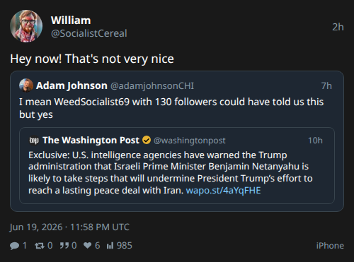
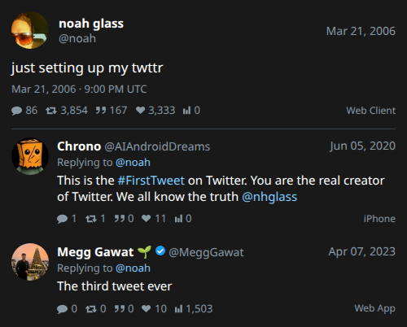

# tw2img

A tool that renders tweets as PNG images using Playwright (headless Chromium). Works with usernames, tweet IDs, URLs, local JSON files, or stdin.

This style is based on [nitter](https://github.com/zedeus/nitter/) using [Midnight](https://github.com/cmj/nitter/blob/master/public/css/themes/midnight.css) theme as default.

|  |  |
|---|---|
| Nested quotes (quoted quotes)  | Grab top 2 replies from tweet_id #22, upload to imgur `tw2img --imgur --top-replies 2 22` |

---

## Installation

### From PyPI (recommended)

```bash
pip install tw2img
playwright install chromium
```

### From source

```bash
git clone https://github.com/cmj/tw2img.git
cd tw2img
pip install playwright
playwright install chromium
```

---

See [Documentation](/docs) for details.

## Quick Start

### 1. Guest Mode (no auth token required, missing context for replies)

```bash
# By @username (fetch latest tweet)
tw2img @AP --guest
# By @username, fetch the 3rd most recent tweet
tw2img @AP 3 --guest
# By tweet ID
tw2img 2041557036274475228 --guest
# By tweet URL
tw2img https://x.com/NASA/status/2041557036274475228 --guest
```

> When running from source, replace `tw2img` with `python tw2img.py`.

Here is a list of popular Twitter accounts sorted by most recent, and useful for guest access:
https://github.com/cmj/twitter-tools/wiki/RSS%E2%80%90Friendly

### 2. Authenticated Mode (full thread + reply data)

You need your Twitter auth tokens. Export them as environment variables:

```bash
export TWITTER_AUTH_TOKEN="your_auth_token_here"
export TWITTER_CSRF_TOKEN="your_ct0_token_here"
# alternative, only requires setting auth_token
export TWITTER_CSRF_TOKEN=$(openssl rand -hex 16)
```

Then run:

```bash
tw2img 2054583770045386950
```

**Where to find tokens:** Open browser devtools, network tab, any x.com request, select cookies tab - `auth_token` and `ct0`.

---

## Basic Options

| Option | Description |
|---|---|
| `@user` | Fetch latest tweet from this user |
| `--user <name>` | Same as above |
| `--light` | Use light theme (default is dark) |
| `--no-source` | Hide the "Twitter for iPhone" source text |
| `--no-context` | Show only the focal tweet, no thread/replies |
| `--last-reply` | Show only the immediate parent tweet + focal tweet (trims long threads) |
| `--top-reply` | Append the top reply (sorted by likes) below the focal tweet |
| `--top-replies <N>` | Append the top N replies (sorted by likes) below the focal tweet (1–20) |
| `--no-nested-quotes` | Don't resolve a quoted tweet's own quoted tweet; show a link instead |
| `--no-retina` | Disable 2x retina rendering (smaller file) |
| `--full-stats` | Show full numbers instead of abbreviated (e.g. 12,345 instead of 12.3K) |
| `--output-dir <path>` | Directory to save output PNG (default: current working directory) |
| `--width 800` | Set output width in pixels (default: 598) |
| `--css theme.css` | File to override the theme (ex: nitter/public/css/themes/pleroma.css) |
| `--nitter` | Use Nitter default theme |
| `--html-only` | Print HTML to stdout instead of rendering PNG |
| `--save-html [FILE]` | Save HTML instead of rendering PNG. Omit `FILE` to auto-name as `<user>-<id>.html` alongside the PNG |
| `--view-html` | Shorthand for `--save-html` + `--view`: auto-save HTML and open it immediately |
| `--imgur` | Upload PNG to imgur after rendering |
| `--dump-json` | Print raw API JSON to stdout and exit |
| `--trans <[SOURCE:]TARGET>` | Translate tweet text before rendering. Target-only (e.g. `--trans en`) auto-detects source; `SOURCE:TARGET` (e.g. `--trans ja:en`) sets both. Requires `pip install deep-translator` |
| `--print-line` | Print a one-line text summary of the focal tweet to stdout |
| `--view` | Automatically open the rendered output file after creation |
| `--viewer <cmd>` | Specify custom viewer executable/command (e.g., `viewnior`, `firefox`, or `kitty +icat {}`) |
| `-c <file>` | Load config from a custom path (see Config below) |

---

## Config File

Options can be set as persistent defaults in a config file (INI format). Config is loaded in this order - later sources override earlier ones:

1. `~/.config/tw2img/tw2img.conf` - user default
2. `<script_dir>/tw2img.conf` - next to the script, if present
3. `-c /path/to/custom.conf` - explicit override
4. Command options / flags always have highest priority

A default config is included as `tw2img.conf`. To install it:

```bash
mkdir -p ~/.config/tw2img
cp tw2img.conf ~/.config/tw2img/tw2img.conf
```

Set a default download directory in the config so you don't have to specify it each run:

```ini
[tw2img]
output_dir = ~/Pictures/tweets
```

If `output_dir` is set, all PNGs are saved there unless you pass an explicit output path (absolute or with a directory component) on the command line.

Use `-c` to load an alternate config for a specific run without touching your defaults:

```bash
tw2img 2054583770045386950 -c ~/work/tw2img-work.conf --light
```

---

## Input Types

```bash
# @username shorthand - latest tweet
tw2img @NASA --guest

# @username shorthand - Nth most recent tweet (1-20, skips RTs and replies)
tw2img @NASA 5 --guest

# Explicit --user flag (equivalent to @username)
tw2img --user NASA --guest

# Tweet ID
tw2img 2054583770045386950 --guest

# Full URL
tw2img "https://x.com/username/status/123456789" --guest

# Local JSON file (from API)
tw2img tweet.json

# Stdin (pipe JSON)
cat tweet.json | tw2img -
```

---

## Output

By default, saves as `<screen_name>-<tweet_id>.png` in current directory. Specify a custom filename as the argument after the input (or after the tweet index when using `@username`):

```bash
# Custom output with tweet ID
tw2img 2054583770045386950 --guest my_screenshot.png

# Custom output with @username shorthand
tw2img @NASA my_screenshot.png --guest

# Custom output with @username and tweet index
tw2img @NASA 3 my_screenshot.png --guest

# Open with a specific GUI viewer
tw2img @NASA --guest --view --viewer viewnior

# Render directly inline inside a supported terminal (like kitty)
tw2img @NASA --guest --view --viewer "kitty +icat {}"

# View directly in Firefox (ideal when combined with --save-html)
tw2img 2054583770045386950 --save-html tweet.html --view --viewer firefox

# Shorthand: auto-save HTML and open immediately (uses viewer from config, default firefox)
tw2img 2054583770045386950 --view-html

# Print a one-line text summary of the focal tweet to stdout
tw2img 21 --print-line --guest
@biz (Biz Stone) ✔ just setting up my twttr | ↳ 153 ⇅ 4.8K ‟ 302 ♥ 4.3K | Web Client | https://x.com/i/status/21

```
---

## Examples

**Basic screenshot with thread (dark mode):**

```bash
tw2img 2054583770045386950 --guest
```

**Latest tweet from a user:**

```bash
tw2img @NASA --guest
```

**5th most recent tweet from a user:**

```bash
tw2img @NASA 5 --guest
```

**Automatically open the snapshot after rendering:**

```bash
tw2img @NASA --guest --view
```

**Upload to imgur:**

```bash
tw2img @NASA --guest --imgur
```

**Light theme, focal tweet only:**

```bash
tw2img 2054583770045386950 --guest --light --no-context
```

**Wide screenshot without source:**

```bash
tw2img 2054583770045386950 --guest --width 800 --no-source
```

**Full stat numbers:**

```bash
tw2img 2054583770045386950 --guest --full-stats
```

**Print HTML to stdout (for inspection or debugging):**

```bash
tw2img 2054583770045386950 --guest --html-only
```


**Save HTML and open immediately:**

```bash
tw2img 2054583770045386950 --guest --view-html
```

**Save HTML to a specific file and open in Firefox:**

```bash
tw2img 2054583770045386950 --guest --save-html tweet.html --view --viewer firefox
```

**Print tweet text:**

```
$ tw2img --print-line --guest 22
```
> @noah (noah glass) just setting up my twttr | ↳ 86 ⇅ 3.9K ‟ 167 ♥ 3.4K | Web Client | https://x.com/i/status/22


**Translate tweet before rendering:**

```bash
# Install the translation dependency once
pip install deep-translator

# Auto-detect source, translate to English
tw2img 2059593901607153975 --guest --trans en

# Explicitly set source -> target (Japanese -> English)
tw2img 2059593901607153975 --guest --trans ja:en
```

> `--trans` translates the tweet text (and any quoted tweet) before rendering. Use `SOURCE:TARGET` to specify both languages, or just `TARGET` to auto-detect. Language codes follow BCP-47 / ISO 639-1 (`en`, `ja`, `fr`, `zh-CN`, etc). Can also be set as a default in `tw2img.conf`:

```ini
[tw2img]
# translate everything not lang:en to english
trans = en
```

---

## Articles

Articles are long-form content that don't render well as a PNG. The recommended approach is to save as HTML and open in a browser via `--view-html`:

```bash
# Preferred: auto-save HTML and open immediately
article2img --guest --view-html https://x.com/ARCRaidersGame/status/2054607629738037736

# Simplify further with an alias
alias tw-article='article2img --guest --view-html'
tw-article https://x.com/XDevelopers/status/2041295840325636551
```

Set `article_viewer = firefox` in `tw2img.conf` to control which browser opens the file.
