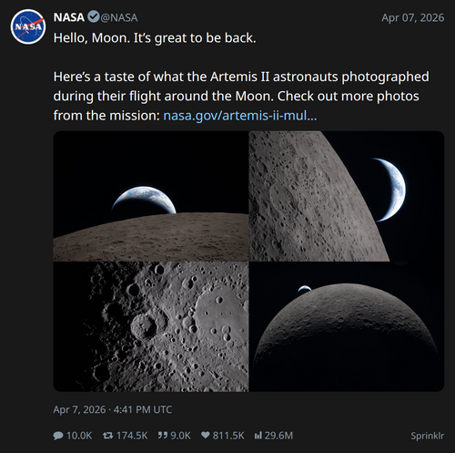

# tw2img

A tool that renders tweets as PNG images using Playwright (headless Chromium). Works with tweet IDs, URLs, local JSON files, or stdin.

|  |  |
|---------------------------------|----------------------|

## Installation

```bash
# Install required packages
pip install playwright
playwright install chromium
```

## Quick Start

### 1. Guest Mode (no login required — limited, missing context for replies)

```bash
# By tweet ID
python tw2img.py 2054583770045386950 --guest

# By tweet URL
python tw2img.py https://x.com/NASA/status/2041557036274475228 --guest
```

### 2. Authenticated Mode (full thread + reply data)

You need your Twitter auth tokens. Export them as environment variables:

```bash
export TWITTER_AUTH_TOKEN="your_auth_token_here"
export TWITTER_CSRF_TOKEN="your_ct0_token_here"
# alternative, only requires setting auth_token
export TWITTER_CSRF_TOKEN=$(openssl rand -hex 16)
```

Then run:

```bash
python tw2img.py 2054583770045386950
```

**Where to find tokens:** Open browser devtools, network tab, any x.com request, select cookies tab `auth_token` and `ct0`

## Basic Options

| Option | Description |
|--------|-------------|
| `--light` | Use light theme (default is dark) |
| `--no-source` | Hide the "Twitter for iPhone" source text |
| `--no-context` | Show only the focal tweet, no thread/replies |
| `--no-retina` | Disable 2x retina rendering (smaller file) |
| `--width 800` | Set output width in pixels (default: 598) |
| `--css custom.css` | Use custom CSS file |
| `--html-only` | Print HTML to stdout instead of rendering PNG |
| `--save-html` | Save HTML to this file instead of rendering PNG |

## Input Types

```bash
# Tweet ID
python tw2img.py 2054583770045386950 --guest

# Full URL
python tw2img.py "https://x.com/username/status/123456789" --guest

# Local JSON file (from API)
python tw2img.py tweet.json

# Stdin (pipe JSON)
cat tweet.json | python tw2img.py -
```

## Output

By default, saves as `<tweet_id>.png` in current directory. Specify custom output:

```bash
python tw2img.py 2054583770045386950 --guest my_screenshot.png
```

## Examples

**Basic screenshot with thread (dark mode):**
```bash
python tw2img.py 2054583770045386950 --guest
```

**Light theme, focal tweet only:**
```bash
python tw2img.py 2054583770045386950 --guest --light --no-context
```

**Wide screenshot without source:**
```bash
python tw2img.py 2054583770045386950 --guest --width 800 --no-source
```

**Print HTML to stdout (for inspection or debugging)**
```bash
python tw2img.py 2054583770045386950 --guest --html-only
```

**Save HTML to a file**
```bash
python tw2img.py 2054583770045386950 --guest --html-only > tweet.html
```
